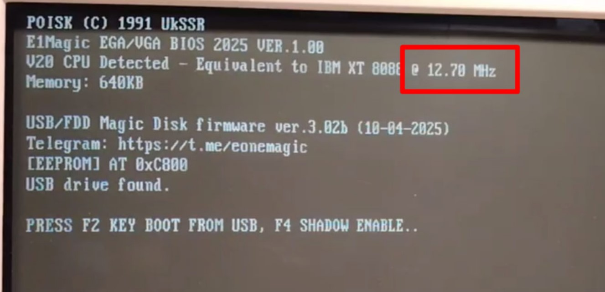

Набор для модернизации ПОИСК-1 (1989/1991)
Этот проект представляет собой комплект переделки ПК ПОИСК-1 под EGA/VGA-графику.

📦 Содержимое

1. Прошивка BIOS для 1989/1991 с поддержкой EGA/VGA

2. Прошивки РТ4 и РТ5 для отключения встроенной видеокарты и памяти.

3. Прошивка новодельного модуля памяти (на базе ATF16V8)

4. Фото с расположением микросхем на плате

⚙️ Выбор прошивки РТ4
В зависимости от конфигурации памяти доступны следующие варианты прошивок РТ4:

Объём встроенной памяти:
128 КБ	0K или 128K
512 КБ	Любая из доступных

💡 Чем меньше активной встроенной памяти, тем быстрее работает система.

🧠 Новодельный модуль памяти:
Если вы используете прошивку 0K для РТ4 (отключая всю набортную память), необходимо прошить новодельный модуль памяти (ATF16V8) прошивкой 0–640K.

Подходит для любых моделей ПОИСК-1 (оба биос под разные клавы в комплекте)

Все прошивки, фото находятся в архиве.

💬 Join the Community

Questions, ideas, or want to contribute?

Join our Telegram chat: https://t.me/eonemagic

We welcome retro computing fans!

